# Khalid Er-Rytouny

<p align="center">
  <picture>
    <source media="(prefers-color-scheme: dark)" srcset="./dark.svg">
    <source media="(prefers-color-scheme: light)" srcset="./light.svg">
    
  </picture>
</p>

## About

I'm **Khalid Er-Rytouny**, a **Full-Stack Developer · Student** focused on web & mobile development · ai engineering.

I'm currently building my skills across modern web development, backend systems, databases, and practical software projects.

## Focus

- Full-stack web development
- Frontend development with React
- Backend development with Node.js, Express, PHP and Laravel
- Database development with MongoDB and MySQL
- Software development with JavaScript

## Engineering Stack

**Languages & Core**
`JavaScript` · `PHP`

**Frontend**
`React` · `HTML` · `CSS` · `Tailwind` · `Bootstrap`

**Backend**
`Node.js` · `Express` · `Laravel`

**Databases**
`MongoDB` · `Mongoose` · `MySQL`

**Tools**
`Git` · `GitHub` · `GitLab` · `Vite` · `npm` · `Postman`

## Selected Projects

### Quran App
A React application using the **AlQuran.cloud API**.

### Station Akhwain
A Laravel application using **MySQL** and business-oriented application workflows.

## Education

**Web & Mobile Development / AI-oriented studies**

## Currently

```text
learn → build → debug → improve → ship
```

---

> This profile is intentionally concise: the banner presents identity and selected technical signals, while the README provides the supporting context.
